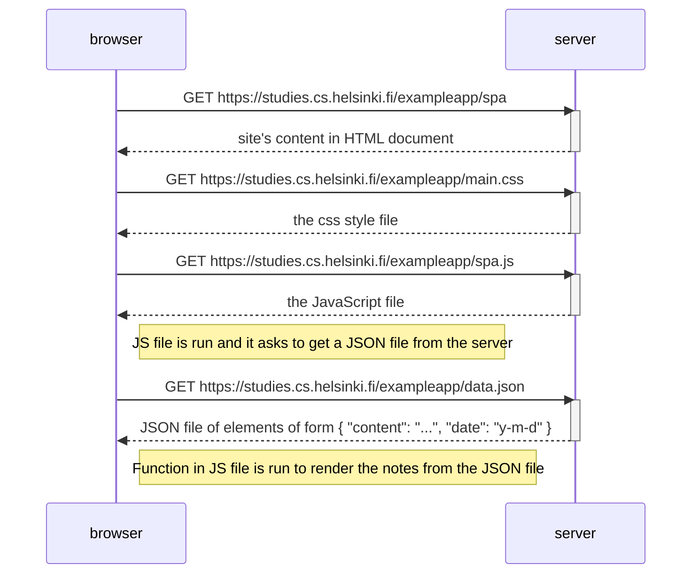

```mermaid
sequenceDiagram
  participant browser
  participant server

  browser->>server: GET https://studies.cs.helsinki.fi/exampleapp/spa
  activate server
  server-->>browser: site's content in HTML document
  deactivate server

  browser->>server: GET https://studies.cs.helsinki.fi/exampleapp/main.css
  activate server
  server-->>browser: the css style file
  deactivate server

  browser->>server: GET https://studies.cs.helsinki.fi/exampleapp/spa.js
  activate server
  server-->>browser: the JavaScript file
  deactivate server

  Note right of browser: JS file is run and it asks to get a JSON file from the server

  browser->>server: GET https://studies.cs.helsinki.fi/exampleapp/data.json
  activate server
  server-->>browser: JSON file of elements of form { "content": "...", "date": "y-m-d" }
  deactivate server

  Note right of browser: Function in JS file is run to render the notes from the JSON file
```
